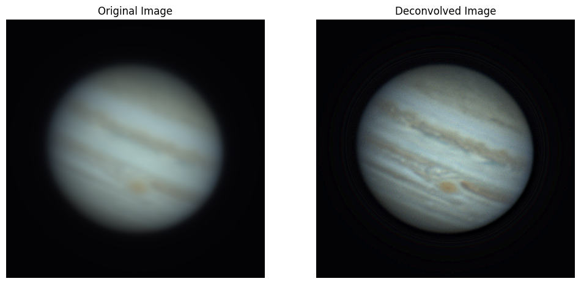

⚠️ _This project is a prototype. Use at your own risk._

# Wavelet Kit

A tool for image deconvolution focused on planetary imaging

    

## Experimental Results

    

## Development

### Setup Environment

Requires poetry. Right now the whole project comes bundled together with app and dev dependencies mixed.

`poetry install`
